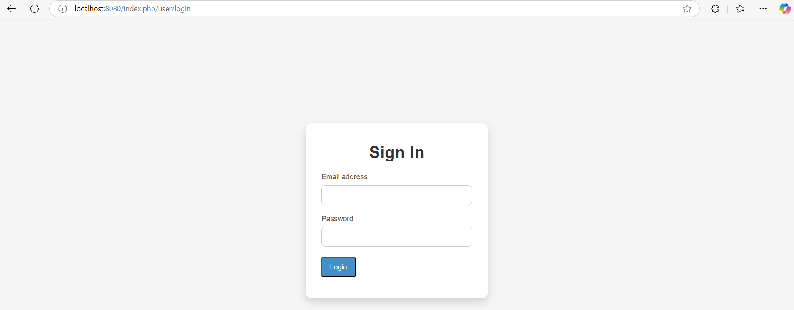
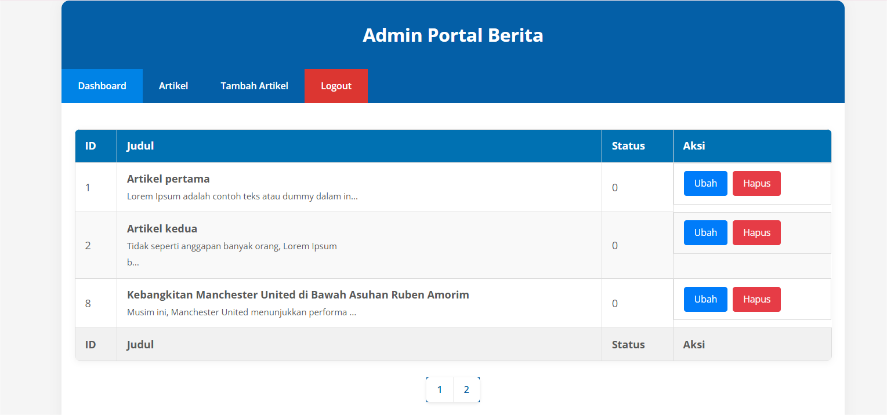
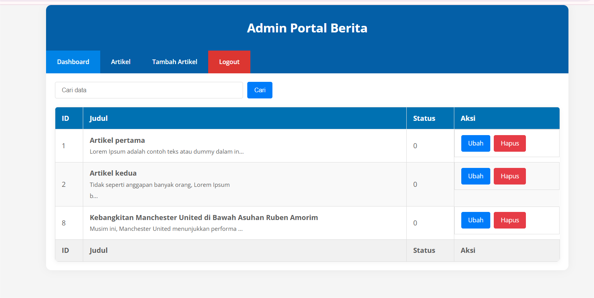
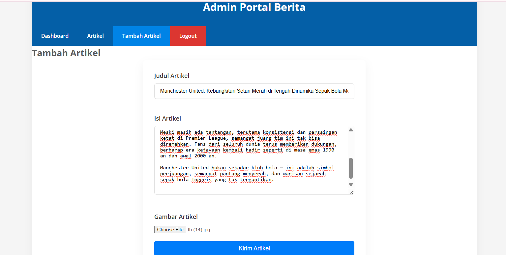

# Praktikum 4 & 6: PHP Framework (CodeIgniter 4)

## PROFIL

|  |  |
| -------- | --- |
| **Nama** | Muhammad Faiz Iqbal |
| **Kelas** | TI.23.A.5 |
| **Mata Kuliah** | Pemrograman Web 2 |
| **Dosen Pengampu** | Agung Nugroho S.kom, M.kom |
---

# Tugas Praktikum 4-6

Dokumen ini berisi laporan tugas untuk praktikum 4 hingga 6 dalam mata kuliah Pemrograman Website 2. Setiap praktikum mencakup implementasi lanjutan menggunakan framework CodeIgniter 4.

Dalam praktikum ini, mahasiswa diharapkan memahami konsep autentikasi, pagination, pencarian, serta upload file dalam pengembangan aplikasi web menggunakan CodeIgniter 4. Setiap tahap dijelaskan secara rinci mulai dari pembuatan modul login, implementasi filter akses, pengembangan fitur pagination dan pencarian, hingga upload file gambar.

Laporan ini juga dilengkapi dengan screenshot hasil implementasi untuk mendukung pemahaman serta sebagai bukti keberhasilan dalam menyelesaikan setiap langkah praktikum. Dengan menyelesaikan tugas ini, mahasiswa diharapkan mampu membangun aplikasi berbasis web dengan fitur yang lebih lengkap dan interaktif.


## Langkah-langkah Praktikum

### **Praktikum 4: Membuat Sistem Login**

#### 1. Persiapkan Database

Buat tabel `user` pada database dengan SQL berikut:

```sql
CREATE TABLE user (
  id INT(11) auto_increment,
  username VARCHAR(200) NOT NULL,
  useremail VARCHAR(200),
  userpassword VARCHAR(200),
  PRIMARY KEY(id)
);
```

#### 2. Membuat Model User

Buat model `UserModel.php` pada direktori `app/Models`:

```php
<?php
namespace App\Models;
use CodeIgniter\Model;

class UserModel extends Model
{
    protected $table = 'user';
    protected $primaryKey = 'id';
    protected $useAutoIncrement = true;
    protected $allowedFields = ['username', 'useremail', 'userpassword'];
}
```

#### 3. Membuat Controller User

Buat controller `User.php` dengan method `index()` dan `login()` untuk mengelola user dan login:

```php
<?php

namespace App\Controllers;

use App\Models\UserModel;

class User extends BaseController
{
    public function index()
    {
        $title = 'Daftar User';
        $model = new UserModel();
        $users = $model->findAll();
        return view('user/index', compact('users', 'title'));
    }
    public function login()
    {
        helper(['form']);
        $email = $this->request->getPost('email');
        $password = $this->request->getPost('password');
        if (!$email)
        {
        return view('user/login');
        }

        $session = session();
        $model = new UserModel();
        $login = $model->where('useremail', $email)->first();
        if ($login)
        {
            $pass = $login['userpassword'];
            if (password_verify($password, $pass))
            {
                $login_data = [
                'user_id' => $login['id'],
                'user_name' => $login['username'],
                'user_email' => $login['useremail'],
                'logged_in' => TRUE,
                ];

                $session->set($login_data);
                return redirect('admin/artikel');
            }
            else
            {
                $session->setFlashdata("flash_msg", "Password salah.");
                return redirect()->to('/user/login');
            }
        }
        else
        {
            $session->setFlashdata("flash_msg", "email tidak terdaftar.");
            return redirect()->to('/user/login');
        }
    }
}
```

#### 4. Membuat View Login

Buat view `login.php` untuk form login:

```html
<!DOCTYPE html>
<html lang="en">
	<head>
		<meta charset="UTF-8" />
		<title>Login</title>
		<link rel="stylesheet" href="<?= base_url('/style.css'); ?>" />
	</head>

	<body>
		<div id="login-wrapper">
			<h1>Sign In</h1>
			<?php if (session()->getFlashdata('flash_msg')): ?>
			<div class="alert alert-danger">
				<?= session()->getFlashdata('flash_msg') ?>
			</div>
			<?php endif; ?>
			<form action="" method="post">
				<div class="mb-3">
					<label for="InputForEmail" class="form-label">Email address</label>
					<input
						type="email"
						name="email"
						class="form-control"
						id="InputForEmail"
						value="<?= set_value('email') ?>"
					/>
				</div>
				<div class="mb-3">
					<label for="InputForPassword" class="form-label">Password</label>

					<input
						type="password"
						name="password"
						class="form-control"
						id="InputForPassword"
					/>
				</div>
				<button type="submit" class="btn btn-primary">Login</button>
			</form>
		</div>
	</body>
</html>
```

#### 5. Membuat Database Seeder

Database seeder digunakan untuk membuat data dummy. Untuk keperluan ujicoba modul login, kita perlu memasukkan data user dan password kedaalam database. Untuk itu buat database seeder untuk tabel user. Buka CLI, kemudian tulis perintah berikut:

```php
php spark make:seeder UserSeeder
```

Selanjutnya, buka file UserSeeder.php yang berada di lokasi direktori/app/Database/Seeds/UserSeeder.php kemudian isi dengan kode berikut:

```php
<?php

namespace App\Database\Seeds;

use CodeIgniter\Database\Seeder;

class UserSeeder extends Seeder
{
    public function run()
    {
        $model = model('UserModel');
        $model->insert([
            'username' => 'admin',
            'useremail' => 'admin@email.com',
            'userpassword' => password_hash('admin123', PASSWORD_DEFAULT),
        ]);
    }
}
```

Selanjutnya buka kembali CLI dan ketik perintah berikut:

```php
php spark db:seed UserSeeder
```

#### Uji Coba Login



#### 6. Membuat Filter Auth

Buat filter `Auth.php` untuk membatasi akses ke halaman admin:

```php
<?php namespace App\Filters;

use CodeIgniter\HTTP\RequestInterface;
use CodeIgniter\HTTP\ResponseInterface;
use CodeIgniter\Filters\FilterInterface;

class Auth implements FilterInterface
{
    public function before(RequestInterface $request, $arguments = null)
    {
        // jika user belum login
        if (! session()->get('logged_in')) {
            // maka redirct ke halaman login
            return redirect()->to('/user/login');
        }
    }
    public function after(RequestInterface $request, ResponseInterface $response, $arguments = null)
    {
        // Do something here
    }
}
```

Selanjutnya buka file app/Config/Filters.php tambahkan kode berikut:

```php
'auth' => App\Filters\Auth::class
```

Selanjutnya buka file app/Config/Routes.php dan sesuaikan kodenya.


#### 7. Percobaan Akses Menu Admin

Buka url dengan alamat http://localhost:8080/admin/artikel ketika alamat tersebut diakses maka, akan dimuculkan halaman login.


#### 8. Fungsi Logout

Tambahkan method logout pada Controller User seperti berikut:

```php
public function logout()
    {
        session()->destroy();
        return redirect()->to('/user/login');
    }
```

---

### **Praktikum 5: Pagination dan Pencarian**

#### 1. Membuat Pagination

Modifikasi controller artikel untuk menambahkan pagination:

```php
public function admin_index()
{
    $title = 'Daftar Artikel';
    $model = new ArtikelModel();
    $data = [
        'title' => $title,
        'artikel' => $model->paginate(10), #data dibatasi 10 record per halaman
        'pager' => $model->pager,
    ];
    return view('artikel/admin_index', $data);
}
```
Kemudian buka file views/artikel/admin_index.php dan tambahkan kode berikut dibawah deklarasi tabel data.
```php
<?= $pager->links(); ?>
```
Selanjutnya buka kembali menu daftar artikel, tambahkan data lagi untuk melihat hasilnya.


#### 2. Membuat Pencarian

Modifikasi controller untuk menambahkan pencarian data:

```php
public function admin_index()
    {
        $title = 'Daftar Artikel';
        $q = $this->request->getVar('q') ?? '';
        $model = new ArtikelModel();
        $data = [
            'title' => $title,
            'q' => $q,
            'artikel' => $model->like('judul', $q)->paginate(10), # data dibatasi 10 record per halaman
            'pager' => $model->pager,
        ];
        return view('artikel/admin_index', $data);
    }
```
Kemudian buka kembali file views/artikel/admin_index.php dan tambahkan form pencarian sebelum deklarasi tabel seperti berikut:
```html
<form method="get" class="form-search">
    <input type="text" name="q" value="<?= $q; ?>" placeholder="Cari data">
    <input type="submit" value="Cari" class="btn btn-primary">
</form>
```
Dan pada link pager ubah seperti berikut.
```php
<?= $pager->only(['q'])->links(); ?>
```

#### 3. Uji Coba Pagination dan Pencarian

Selanjutnya ujicoba dengan membuka kembali halaman admin artikel, masukkan kata kunci tertentu pada form pencarian.


---

### **Praktikum 6: Upload File Gambar**

#### 1. Modifikasi Controller Artikel

Buka kembali Controller Artikel pada project sebelumnya, sesuaikan kode pada method add seperti berikut:

```php
public function add()
    {
        // validasi data.
        $validation = \Config\Services::validation();
        $validation->setRules(['judul' => 'required']);
        $isDataValid = $validation->withRequest($this->request)->run();
        if ($isDataValid) {
            $file = $this->request->getFile('gambar');
            $file->move(ROOTPATH . 'public/gambar');
            $artikel = new ArtikelModel();
            $artikel->insert([
                'judul' => $this->request->getPost('judul'),
                'isi' => $this->request->getPost('isi'),
                'slug' => url_title($this->request->getPost('judul')),
                'gambar' => $file->getName(),
            ]);
            return redirect('admin/artikel');
        }
        $title = "Tambah Artikel";
        return view('artikel/form_add', compact('title'));
    }
```

#### 2. Modifikasi View Artikel

Tambahkan field input file pada form artikel:

```html
<p>
    <input type="file" name="gambar">
</p>
```
Dan sesuaikan tag form dengan menambahkan ecrypt type seperti berikut.
```html
<form action="" method="post" enctype="multipart/form-data">
```

#### 3. Uji Coba Upload Gambar

Akses menu tambah artikel dan uji coba upload gambar.

---

## Laporan Praktikum

1. Pastikan untuk screenshot setiap perubahan yang dilakukan pada setiap langkah praktikum.
2. Update file `README.md` dan tuliskan penjelasan serta screenshot dari setiap langkah praktikum.
3. Commit hasilnya pada repository dan kirimkan URL repository ke e-learning.

---

## SELESAI  

- Email: mfaiziqbal01@gmail.com

 